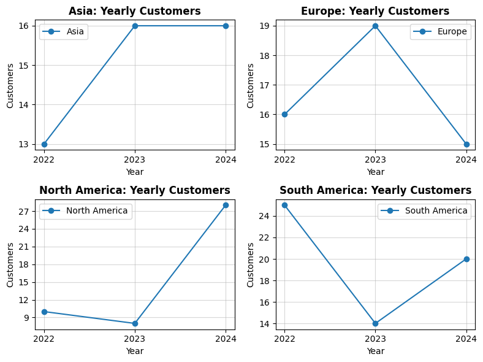
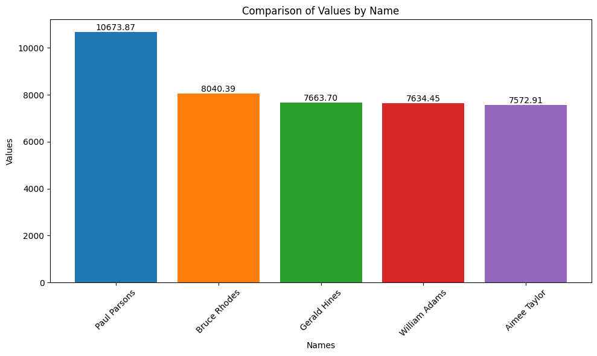
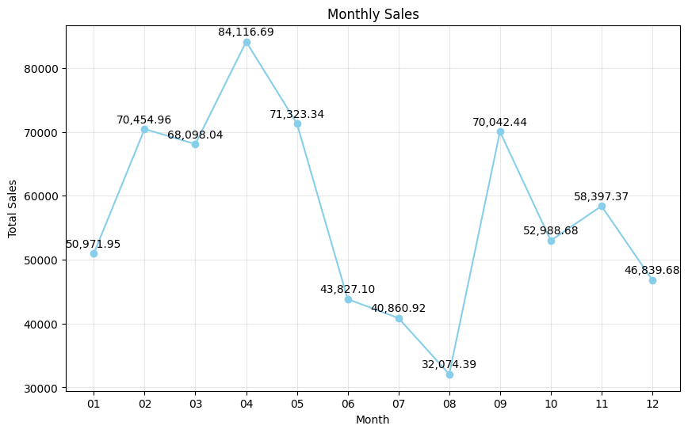

## Here are **5 business insights** derived from the EDA:

### 1.  **Regional Customer Trends**

* **North America** experienced the highest customer growth from  **2023 to 2024** , rebounding after a dip in 2023, while **Asia** showed steady growth before stabilizing. **Europe** peaked in 2023 but declined in 2024, indicating possible market saturation or customer churn. **South America** faced a sharp decline in 2023 but recovered in 2024. Understanding **North America’s surge, Europe’s decline, and South America's fluctuations** can help refine marketing strategies, improve customer retention, and drive sustainable growth across regions.
  

### 2.  **Price Variation Across Categories** :

* Product categories like **Books** and **Clothing** exhibit significant price variation, with Books ranging from **33.59 to 497.76** (S.D. **153.80** ) and Clothing from **18.82 to 481.78** (S.D.  **157.96** ). This suggests a diverse customer base, spanning both budget-conscious and premium buyers. In contrast, **Electronics** and **Home Decor** have relatively lower price dispersion. Businesses can leverage this insight by implementing **tiered pricing strategies, targeted promotions, and personalized marketing** to cater effectively to both value-driven and high-end consumers, maximizing revenue potential across segments.

### 3.  **Top-Spending Customers** :

* The top 5 customers have demonstrated significantly higher spending, with **Paul Parsons** leading at **10,673.87**, followed by **Bruce Rhodes, Gerald Hines, William Adams, and Aimee Taylor**. Their spending spans across Europe, Asia, North America, and South America, highlighting the global distribution of premium buyers. Implementing exclusive loyalty programs, personalized discounts, and targeted upselling strategies can strengthen engagement and retention. Additionally, analyzing their purchase patterns can provide insights to attract similar high-value customers, ultimately driving sustained revenue growth across key regions.
  

### 4.  **Monthly Spending Trends** :

* Customer spending peaks in March (68,098.04) and April (84,116.69), while June (43,827.10) and August (32,074.39) show noticeable declines. This indicates a seasonal purchasing trend, likely influenced by promotions, product demand cycles, or external factors like holidays. To maximize revenue, businesses should implement targeted marketing campaigns, seasonal discounts, and limited-time offers during slower months to boost sales and engagement. Additionally, analyzing high-performing months can help refine promotional strategies, ensuring consistent revenue flow throughout the year.

  

### 5.  **Product Popularity and Count** :

* The Books, Electronics, and Clothing categories each offer 25+ products, with a consistent unique product range of 15 to 18, indicating a well-balanced portfolio catering to diverse customer preferences. Maintaining this variety ensures broad market appeal, but further sub-category analysis can identify underperforming products, helping to optimize inventory, reduce holding costs, and improve sales efficiency. Strategic adjustments, such as discontinuing slow-moving items or expanding high-demand sub-categories, can enhance profitability and customer satisfaction.

These insights integrate various facets of the EDA, from regional trends and pricing variation to customer behavior, monthly spending, and product assortment.
